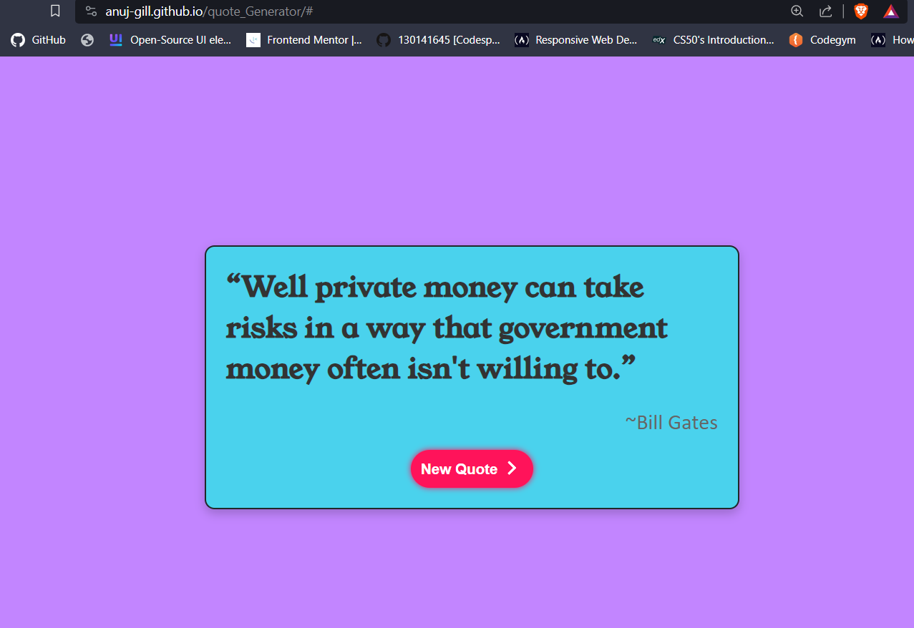

# Random Quote Generator

## Table of Contents

- [About](#about)
- [Demo](#demo)
- [Features](#features)
- [Usage](#usage)
- [API](#api)
- [Contributing](#contributing)
- [License](#license)

## About

The Random Quote Generator is a web application that allows users to generate random quotes and display them on the screen. It provides inspirational, funny, or thought-provoking quotes along with the names of the authors.

## Demo

You can see a live demo of the Random Quote Generator [here](https://anuj-gill.github.io/quote_Generator/#).

## Features

- Display random quotes on the screen.
- Show the name of the author for each quote.
- Generate new quotes with a button click.

## Usage

1. Open the `index.html` file in your web browser.
2. Click the "New Quote" button to generate a random quote.
3. The generated quote and the author's name will be displayed on the screen.

## API

The Random Quote Generator uses the [API Ninjas](https://api.api-ninjas.com) API to fetch random quotes. You can find more information about their API and how to use it on their website.

## Contributing

If you would like to contribute to this project, feel free to fork the repository, make your changes, and submit a pull request. We welcome any contributions that improve the application's functionality or user experience.

## License

Happy quoting!
