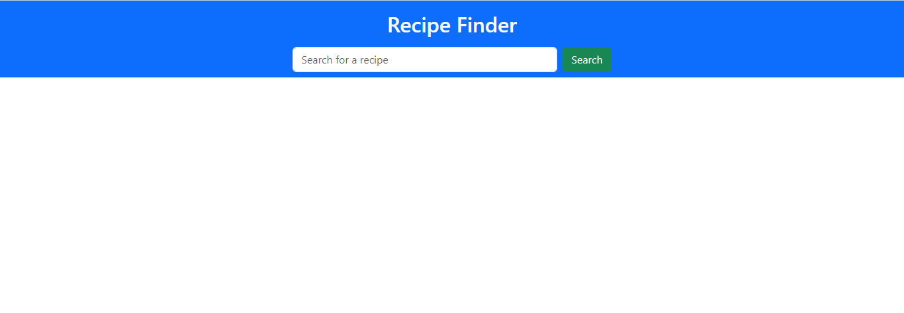
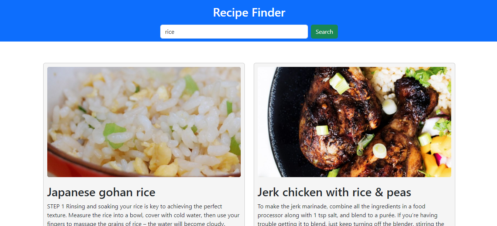

## RECIPE FINDER

### Goal

A responsive Recipe Finder App which utilizes TheMealDB API to search for and display recipes. The app allows users to search for recipes 
by entering a search term and displays matching recipes with their images and instructions. It's built using HTML, CSS and JavaScript.

### Features

- Search for the recipes by entering a keyword
- Displays recipe results with images and instructions
- Responsive design that supports various screen sizes
- User-friendly interface with a clean and appealing layout
  
### Screenshots

**First Screen**

 

**Search Screen**

 

